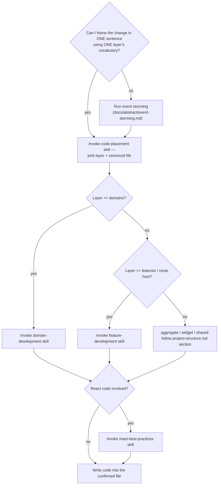

# Architecture

The mandatory first step for any decision-driven code change. You do NOT generate a file path, pick a layer, or open the authoritative flow docs yourself — this skill routes you through the right sub-skills in the right order. Skipping it is how code lands in the wrong layer and how non-canonical files (`changes.ts`, `manager.ts`, `helpers.ts`) get invented.

**Letter vs spirit:** entering this skill and then free-handing the decision anyway is a violation. Run the steps.

**Trivial vs non-trivial** (`docs/code/glossary.md`): a **trivial in-place edit** — one existing file, no new file, no new public surface, no layer crossing — skips this skill. Everything else is **non-trivial** and runs the full flow below, including a written plan. If you're unsure, it's non-trivial.

## Orchestration order

## The four steps

1. **Frame it.** State the change in one sentence using one layer's vocabulary. Can't — two vocabularies, or the actor/trigger/post-state is unclear? The model is ambiguous: run event storming (`docs/abstract/event-storming.md`) with the user, then continue. Do not guess the layer.
2. **Place it.** Invoke `code-placement`. It returns the layer AND the canonical file kind. A file under `src/domains/` may ONLY be one of: `types`, `service`, `resource`, `hooks`, `gateway`, `repository`, `schemas`, `constants`, `index`, `README`, `bootstrap`, or a `$usecase/` file. No canonical home for your logic → **STOP and ask the user.** Never invent a filename to resolve the ambiguity.
3. **Follow the authoritative flow.** Route by the placed layer:
   - `src/domains/` → `domain-development` skill.
   - `src/features/` or a route hosting a feature → `feature-development` skill.
   - aggregate / widget / shared → the matching section of `docs/code/project-structure.md` (no dedicated skill).
4. **React rules.** Touching components/hooks/rendering → also invoke `react-best-practices`.

## Non-trivial changes — clarify, then plan

For a non-trivial change (per the glossary), do not start writing after placement. First:

**Clarify the gaps.** Surface ambiguity *before* committing to a design — the user prefers a few questions and a right plan over zero questions and a wrong one. Use `AskUserQuestion` (1–4 at a time, plan-shaping first) for: requirements that admit two readings; relevant corner cases (empty/offline/double-fire/precondition-not-met); error surfaces; and **contradictions** — if the request conflicts with a rule, seam, or how a subsystem actually works, quote the conflict and ask, don't silently bend the request to fit. If codebase research shows the user's premise is stale, say so and discuss. Don't ask about trivia you can settle by reading a doc.

**Write a short plan** to `docs/_plans/<topic>-plan.md` (the dedicated home for architectural plans). Name: the layers and **canonical files** touched, what is `must_not_touch` / `out_of_scope`, the seams used, and the verification approach. This is the contract `reviewer` later diffs the implementation against — scope creep is only detectable if scope was written down. Keep it lean; for a small non-trivial change a dozen lines is enough.

## Closing the loop — rule extraction

When the user corrects you during planning or implementation in a way that **generalizes** beyond this task ("X always goes in Y", "we don't do Z"), run the rule-extraction pass from `docs/code/rule-extraction.md` before finishing: propose the durable rule, and on approval append it to the matching doc + reviewer checklist (and flag it for a hook if greppable). Skip silently if the user made no substantive corrections. This is what stops the same mistake recurring next session — a correction that isn't captured is one you'll repeat.

## Red flags — you are skipping the process

- About to type a path under `src/` without having run `code-placement`.
- Inventing a descriptive filename because nothing fits → that is the signal to STOP and ask, not to name it.
- "It's obvious where this goes" on a multi-file or new-abstraction change → frame and place it anyway; obvious-feeling placements are where layer leaks start.
- Reaching for `domain-development`/`feature-development` before deciding the layer — placement comes first.

## See also

- `docs/code/glossary.md` — trivial vs non-trivial, peer file, multi-source, trust boundary.
- `docs/code/project-structure.md` — layer definitions and per-file contracts.
- `docs/code/code-placement.md` — full layer/file decision framework + cut rules.
- `docs/code/architecture.md` — how artifacts interact at runtime.
- `docs/code/rule-extraction.md` — turning a correction into a durable rule.
- `reviewer` skill — audits the implementation against the plan and the checklists.
