# Architecture

The mandatory first step for any decision-driven code change, and the orchestrator of the **full lifecycle** from a freeform prompt: frame → place → (brainstorm → approve → plan) → implement → review → fix. You do NOT generate a file path, pick a layer, or open the authoritative flow docs yourself — this skill routes you through the right sub-skills in the right order. Skipping it is how code lands in the wrong layer and how non-canonical files (`changes.ts`, `manager.ts`, `helpers.ts`) get invented.

**Letter vs spirit:** entering this skill and then free-handing the decision anyway is a violation. Run the steps.

**Trivial vs non-trivial** (`docs/code/glossary.md`): a **trivial in-place edit** — one existing file, no new file, no new public surface, no layer crossing — skips this skill. Everything else is **non-trivial** and runs the full flow below: written plan → approval → implementation → mandatory review → fix loop. If you're unsure, it's non-trivial.

## Orchestration order

```mermaid
flowchart TD
    Frame{"Can I frame the change in ONE sentence<br/>using ONE layer's vocabulary?"}
    Storm["Run event storming<br/>(docs/abstract/event-storming.md)"]
    Place["Invoke code-placement skill —<br/>pick layer + canonical file"]
    IsDomain{"Layer == domains?"}
    IsFeature{"Layer == features / route host?"}
    Domain["Invoke domain-development skill"]
    Feature["Invoke feature-development skill"]
    Other["aggregate / widget / shared:<br/>follow project-structure.md section"]
    IsReact{"React code involved?"}
    React["Invoke react-best-practices skill"]
    Brainstorm["Delegate to superpowers:brainstorming<br/>(+ project context) → design in docs/_plans/"]
    Approve{"User approves the design?<br/>(brainstorming HARD-GATE)"}
    Plan["Delegate to superpowers:writing-plans<br/>(+ project context) → docs/_plans/&lt;topic&gt;-plan.md"]
    Write["Write the edit directly (terminal)"]
    Implement["Stage 4 — implement: delegate to<br/>superpowers:subagent-driven-development<br/>(current branch, + project context)"]
    DevGate{"Discovery invalidates the plan?"}
    Amend["HARD STOP → present 2-3 options →<br/>amend docs/_plans/&lt;topic&gt;-plan.md<br/>(superpowers:writing-plans)"]
    ReApprove{"User approves the amendment?"}
    Review["Stage 5 — invoke project reviewer skill<br/>→ docs/_reviews/&lt;topic&gt;-review.md"]
    IssuesGate{"Blocking / major findings?"}
    Done["Done — minors surfaced;<br/>finishing (merge/PR) is manual"]

    Frame -- no --> Storm
    Frame -- yes --> Place
    Storm --> Place
    Place --> IsDomain
    IsDomain -- yes --> Domain
    IsDomain -- no --> IsFeature
    IsFeature -- yes --> Feature
    IsFeature -- no --> Other
    Domain --> IsReact
    Feature --> IsReact
    Other --> IsReact
    IsReact -- yes --> React
    IsReact -- no --> Gate
    React --> Gate
    Gate{"Non-trivial?"}
    Gate -- "no (trivial)" --> Write
    Gate -- yes --> Brainstorm
    Brainstorm --> Approve
    Approve -- "no, revise" --> Brainstorm
    Approve -- yes --> Plan
    Plan --> Implement
    Implement --> DevGate
    DevGate -- "yes (hard stop)" --> Amend
    DevGate -- no --> Review
    Amend --> ReApprove
    ReApprove -- "no, revise" --> Amend
    ReApprove -- yes --> Implement
    Review --> IssuesGate
    IssuesGate -- yes --> Amend
    IssuesGate -- no --> Done
```

This is the **full lifecycle from a single freeform prompt**: frame → place → (brainstorm → approve → plan) → implement → review → fix. On a non-trivial change you never reach implementation until `superpowers:brainstorming` has presented a design, the user approved it, and `superpowers:writing-plans` produced the plan in `docs/_plans/`. Implementation is delegated to `superpowers:subagent-driven-development`; review is the project `reviewer` skill. The `Amend` node is shared by **two** loops — a plan-invalidating discovery mid-implementation (stage 4) and a blocking/major review finding (stage 6) are the same move: stop, present options, amend the plan, **re-approve**, re-implement. Every plan change — initial or amendment — passes the same approval gate; the loop is not autonomous. The generic process (clarify → design → plan → execute) is **delegated to superpowers**; this skill adds the project frame and the review/fix gates.

## The steps

1. **Frame it.** State the change in one sentence using one layer's vocabulary. Can't — two vocabularies, or the actor/trigger/post-state is unclear? The model is ambiguous: run event storming (`docs/abstract/event-storming.md`) with the user, then continue. Do not guess the layer.
2. **Place it.** Invoke `code-placement`. It returns the layer AND the canonical file kind. The closed set of file kinds a `src/domains/` module may contain is defined in `docs/code/project-structure.md` (§ File contracts) and enforced by the PreToolUse hook — this skill does not restate it. No canonical home for your logic → **STOP and ask the user.** Never invent a filename to resolve the ambiguity.
3. **Consult the authoritative flow.** Route by the placed layer and read its guidance — this informs the plan, it is not yet permission to write code:
   - `src/domains/` → `domain-development` skill.
   - `src/features/` or a route hosting a feature → `feature-development` skill.
   - aggregate / widget / shared → the matching section of `docs/code/project-structure.md` (no dedicated skill).
   - Touching components/hooks/rendering → also invoke `react-best-practices`.
4. **Brainstorm, plan, and get approval — BEFORE any implementation** (non-trivial changes; see "Non-trivial changes" below). This is **delegated to superpowers**. A trivial in-place edit skips straight to step 5 and stops there — no review/fix tail.
5. **Implement.** Only after the design is approved and the plan exists. Delegate to `superpowers:subagent-driven-development` (current branch), carrying the project context. If a discovery invalidates the plan mid-flight → **hard stop and amend** (see "Implementing — handling plan deviations").
6. **Review.** When implementation completes, automatically invoke the project `reviewer` skill — it is the mandatory stage-5 gate (see "Reviewing and fixing"). Not optional, not the generic superpowers final review.
7. **Fix loop.** Blocking/major findings → amend the plan, re-approve, re-implement, re-review until mergeable. Minor findings → surface, let the user decide. Finishing (merge/PR) is a separate manual step.

## Non-trivial changes — delegate brainstorming + planning to superpowers

For a non-trivial change (per the glossary), **the plan precedes the implementation — it is not a write-up produced afterward.** Do not write implementation code until the user has approved a design. The generic clarify → design → approval → plan process is **owned by superpowers** (a declared project dependency — see `.claude/settings.json` `enabledPlugins`). This skill does not re-implement it; it injects the project frame and delegates:

**1. Invoke `superpowers:brainstorming`.** It clarifies requirements one question at a time, proposes approaches, presents a design, and **gates on user approval before any implementation** (its HARD-GATE — this is what satisfies the always-stop-for-approval rule). Override its default artifact location: write the design to **`docs/_plans/<topic>-design.md`**, not `docs/superpowers/specs/`.

**2. Invoke `superpowers:writing-plans`.** It turns the approved design into the implementation plan. Override its default artifact location: write the plan to **`docs/_plans/<topic>-plan.md`**, not `docs/superpowers/plans/` — this is the path `reviewer` diffs the implementation against.

**3. Carry this project context INTO both delegated skills** (this is the part superpowers cannot know — without it, it makes generically-reasonable but architecturally-wrong decisions):

- **Placement is a fixed input, not a re-decision.** The layer + canonical file kind returned by `code-placement` are settled. Brainstorming/planning design _within_ that placement; they do not re-pick the layer or invent file structure — the canonical file kinds are the closed set in `project-structure.md`, hard-blocked by the PreToolUse hook.
- **Honor the layer contract.** Import rules, layer boundaries, and the anti-patterns in `docs/code/project-structure.md` constrain every "where does this go / what calls what" decision. Pass the relevant `domain-development` / `feature-development` guidance (from step 3) as the design's ground truth.
- **Use the domain's ubiquitous language.** Naming follows the domain `README.md` glossary — one concept, one name. Don't let the design coin synonyms.
- **The plan must satisfy the `reviewer` contract.** Beyond superpowers' task breakdown, the plan MUST name: the layers and **canonical files** touched, what is `must_not_touch` / `out_of_scope`, the seams (DI slots/pipelines/use cases) used, and the verification approach. Scope creep is only detectable if scope was written down.
- **Testing follows project conventions** — vitest `*.spec.ts` / `*.test.tsx` with the project's run command (`npx vitest run <path>`), not the skill's pytest examples.

If superpowers is unavailable (a teammate or CI without the plugin), fall back to running the same three substeps inline — clarify with `AskUserQuestion`, write `docs/_plans/<topic>-plan.md`, present it and stop for approval — applying the same project context above. The dependency is declared so this fallback is rarely needed, not because the gate is optional.

## Implementing — handling plan deviations

Once the plan is approved, implement it by delegating to `superpowers:subagent-driven-development` on the **current branch** (no worktree is mandated; treat the skill's worktree step as optional). Carry the same project-context block into the implementer subagents — placement is fixed, canonical filenames only, layer contract and ubiquitous language hold, tests are vitest.

**The plan is a contract. When implementation reveals it is wrong, you do NOT improvise.** Superpowers' execution skills only escalate open-endedly ("stop and ask the human" on a `BLOCKED` / plan-wrong status); the project requires a sharper move. Trigger a **hard stop** when: an implementer reports `BLOCKED` or `DONE_WITH_CONCERNS` meaning the plan itself is wrong, OR a discovery during implementation invalidates a plan assumption (a seam doesn't exist, the placed file can't hold the logic, a new constraint surfaces). On trigger:

1. **HARD STOP.** Do not silently deviate from the approved plan or patch around the problem.
2. **Notify the user and present 2-3 concrete amendment options** with trade-offs. This pattern is borrowed from `superpowers:brainstorming` ("propose 2-3 approaches") — superpowers has no dedicated deviation skill, so this is the project's addition, not something to delegate.
3. On the user's choice, **amend `docs/_plans/<topic>-plan.md`** via `superpowers:writing-plans` (update scope, files, seams — keep it the same plan document).
4. **Re-approval gate.** An amendment is a plan change; it passes the same approval gate as the initial plan. There is no standing bypass — present the amended plan, wait for approval.
5. **Resume** `subagent-driven-development` from the affected task.

## Reviewing and fixing

**Stage 5 — review (mandatory).** When all plan tasks complete, automatically invoke the project `reviewer` skill. It is **rule-aware** (cites `docs/claude/*-checklist.md`, diffs the implementation against the plan's `must_not_touch` / `out_of_scope` / scope) — this is why it replaces superpowers' generic final review rather than running alongside it. It writes `docs/_reviews/<topic>-review.md` (same `<topic>` as the plan) and returns a verdict with blocking / major / minor counts.

**Stage 6 — fix loop.** Route by severity:

- **Blocking / major** → treat exactly like a plan deviation: amend `docs/_plans/<topic>-plan.md` with the fixes via `superpowers:writing-plans`, **re-approve**, re-implement via `subagent-driven-development`, then re-run `reviewer`. Loop until the verdict is mergeable. (This is the same `Amend → ReApprove → Implement` loop as stage 4 — a finding is just another new input.)
- **Minor** → surface to the user; let them choose fix-now vs defer. Do not loop on minors.

Finishing the branch (tests, merge/PR) stays a **separate, user-initiated step** — this skill's lifecycle ends at a clean review verdict, not at a merge.

## Closing the loop — rule extraction

When the user corrects you during planning or implementation in a way that **generalizes** beyond this task ("X always goes in Y", "we don't do Z"), run the rule-extraction pass from `docs/code/rule-extraction.md` before finishing: propose the durable rule, and on approval append it to the matching doc + reviewer checklist (and flag it for a hook if greppable). Skip silently if the user made no substantive corrections. This is what stops the same mistake recurring next session — a correction that isn't captured is one you'll repeat.

## Red flags — you are skipping the process

- **Writing the plan after the code is already written** → the plan is a contract you build _to_, not a summary of what you built. On a non-trivial change the design is approved and the plan lands in `docs/_plans/` _before_ the first implementation edit.
- **Starting to edit implementation files on a non-trivial change before the design was approved** → stop, run `superpowers:brainstorming`, get approval, then `superpowers:writing-plans`.
- **Re-implementing clarify/design/plan prose inside this skill** → that process is delegated to superpowers; this skill only injects the project frame. Don't hand-roll a parallel flow.
- **Restating a list or definition that an authoritative doc owns** (the canonical file kinds, the trivial/non-trivial criteria, layer import rules, per-file contracts) → reference the doc, don't copy it. Duplicated enumerations drift silently when the doc changes. This skill _orchestrates and routes_; `project-structure.md` / `code-placement.md` / `glossary.md` _define_.
- **Letting the delegated skill re-pick the layer, invent a non-canonical filename, or write the plan to `docs/superpowers/`** → placement is fixed by `code-placement`, filenames are the canonical set, and the plan goes to `docs/_plans/`.
- **Improvising around a plan-invalidating discovery mid-implementation** → hard stop, present 2-3 options, amend the plan, re-approve. Silently deviating from an approved plan is the exact failure the gate exists to prevent.
- **Finishing implementation without running the project `reviewer`** → review is the mandatory stage-5 gate, not an optional follow-up. The generic superpowers final review does not substitute for it.
- **Looping on review fixes without re-approving the amended plan** → blocking/major findings amend the plan, and every plan change re-passes approval. The fix loop is not autonomous.
- About to type a path under `src/` without having run `code-placement`.
- Inventing a descriptive filename because nothing fits → that is the signal to STOP and ask, not to name it.
- "It's obvious where this goes" on a multi-file or new-abstraction change → frame and place it anyway; obvious-feeling placements are where layer leaks start.
- Reaching for `domain-development`/`feature-development` before deciding the layer — placement comes first.

## See also

- `docs/code/glossary.md` — trivial vs non-trivial, peer file, multi-source, trust boundary.
- `docs/code/project-structure.md` — layer definitions and per-file contracts.
- `docs/code/code-placement.md` — full layer/file decision framework + cut rules.
- `docs/code/architecture.md` — how artifacts interact at runtime.
- `docs/code/rule-extraction.md` — turning a correction into a durable rule.
- `reviewer` skill — audits the implementation against the plan and the checklists.
