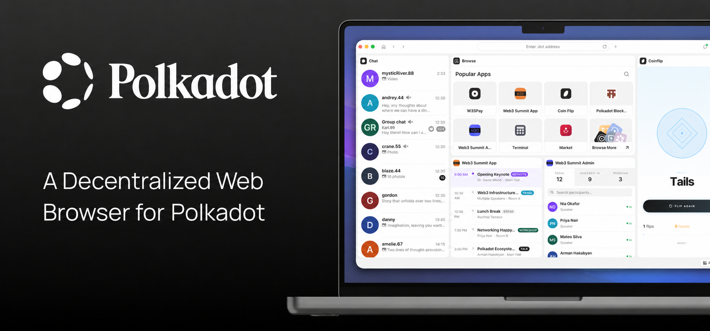

> [!WARNING]
> The following is a prototype, reference implementation, and proof-of-concept. This open source code is provided for research, experimentation, and developer education only. This code has not been audited, is actively experimental, and may contain bugs, vulnerabilities, or incomplete features. Use at your own risk.

<div align="center">
  

# Polkadot Desktop

*A desktop browser for Polkadot applications. Open any app by its on-chain name, run it in a sandbox you control, and sign with your phone — no web servers in the loop.*

[](./LICENSE)
[](#getting-started)
[](https://www.typescriptlang.org)
[](https://polkadot.com)



</div>

## Features

- **Browse apps by name** — Type a dotNS name and the app's content resolves on-chain, loads from the Bulletin Chain / IPFS, and renders in a tab. No DNS, no hosting servers.
- **Sandbox with permissions you control** — Every app runs isolated and asks before using the camera, signing, storage, notifications, or the network. Grant and revoke per app, any time.
- **Sign with your phone** — Pair with the Polkadot App by scanning a QR code. Your keys stay on your phone; the desktop sends every transaction there for approval.
- **Chat without messaging servers** — End-to-end encrypted messaging with incoming attachments (sending coming later), reactions, replies, and edits, delivered through Polkadot's on-chain statement store.
- **Multi-device sync** — Contacts and chats sync between Polkadot Desktop and the Polkadot App over an encrypted peer-to-peer channel.
- **Dashboard widgets** — Pin apps to the dashboard as live widgets, organize them into dashboard spaces, and launch your favorites in one click.
- **Offline access** — Install an app once and keep using it without a network connection.
- **Light-client support** — Chain access runs through an in-app light client; you don't have to trust a remote RPC provider.

## Getting started

<details>
<summary>Prerequisites</summary>

- **Node.js** v20+
- **npm** v10+

</details>

Clone the repo, install dependencies, and start the dev stack:

```bash
git clone https://github.com/paritytech/polkadot-desktop-community.git
cd polkadot-desktop-community

npm install

# Full Electron dev stack (main + preload + renderer, all watching)
npm start

# Or the web-only renderer dev server
npm run start:web
```

Copy [`.env.example`](./.env.example) to `.env` and fill in your Firebase Remote Config identifiers — the chain catalog is served from Remote Config, so the app needs them to connect to networks. Optional features whose configuration is empty (crash reporting, auto-update, TURN relay) stay disabled. Every variable is documented in [`.env.example`](./.env.example) and [docs/PUBLISHING.md](./docs/PUBLISHING.md).

The app talks to Polkadot system chains (People Chain, Asset Hub, Bulletin Chain), and development builds are exercised against Polkadot's [Paseo](https://wiki.polkadot.network/docs/learn-paseo) testnet contour.

### Test and check from the command line

```bash
npm test           # Unit tests
npm run lint       # Linter
npm run types      # Type check
npm run build      # Production build
```

For the full command reference (E2E, packaging, Polkadot API codegen, Storybook) see [CLAUDE.md](./CLAUDE.md#commands). Packaging, signing, and distribution are documented in [docs/PUBLISHING.md](./docs/PUBLISHING.md).

## How it works

Polkadot Desktop is a browser for a web that lives on-chain: apps are published to Polkadot's public chains instead of web servers, and your identity comes from your phone instead of a login form.

### What it does

1. **Opens apps without web servers.** When you enter a name, the desktop resolves it through dotNS (Polkadot on-chain naming) to a content identifier, fetches the app's bundle from the Bulletin Chain or IPFS, and renders it locally. What you see is exactly what was published on-chain — there is no hosting server that can swap content under you.
2. **Keeps your keys on your phone.** You sign in by pairing with the Polkadot App over a QR code. The desktop never holds your account keys: every transaction an app requests is sent to your phone, where you see what you're signing and approve or reject it.
3. **Puts every app in a sandbox.** Apps run in isolated containers with their own scoped storage and identity. Access to the camera, signing, notifications, storage, or external networks goes through permission prompts — you decide per app, and you can review and revoke everything in Settings.
4. **Chats through the chain, not a company inbox.** Messages are end-to-end encrypted and delivered via the People Chain statement store, so no messaging server holds your conversations. File attachments travel directly peer-to-peer.
5. **Works as one account across devices.** Your contacts and chats sync between the desktop and your phone over the same encrypted channels, and apps can run as live dashboard widgets or background workers while you browse.

### What it doesn't do

- It does **not** hold your keys or your money — signing authority stays on your paired phone. There is no custodian, and nobody can move your account from the desktop.
- It does **not** route your data through company servers — names resolve on-chain, content comes from the Bulletin Chain / IPFS, and messages travel through the public chain. At present the preferred method for retrieving chain data is RPC, with light-client access supported.
- It is **not** a production-hardened product — treat it as a reference implementation (see the warning at the top).

### Under the hood

An Electron app with three build targets — `main` (Node.js), `preload` (bridge), and `renderer` (the web app, which also runs standalone in a browser). The renderer is React + RxJS organized into domains / aggregates / features; chain access goes through [polkadot-api](https://github.com/polkadot-api/polkadot-api) over RPC or a [smoldot](https://github.com/smol-dot/smoldot) light client; apps integrate via the host-container bridge ([`@novasamatech/host-api`](https://www.npmjs.com/package/@novasamatech/host-api)). Architecture conventions and module layout are documented in [CLAUDE.md](./CLAUDE.md) and [docs/](./docs/code/project-structure.md).

## Development

### Environments

| Build | Command | Chains config | Debug tools | Error handling |
|-------|---------|---------------|-------------|----------------|
| Development | `npm run build:dev` | testnet catalog | on | off (fail loud) |
| Staging | `npm run build:staging` | production catalog | on | graceful |
| Production | `npm run build` | production catalog | off | graceful |

### Localisation

Localisation files live in `src/locales/`. ESLint validates that the JSON is well-formed, every locale has the same keys and placeholders, and all `tsx` files are translated. When a string must stay untranslated, disable the rule explicitly:

```tsx
{/* eslint-disable-next-line i18next/no-literal-string */}
{data?.asset.symbol}
```

### Troubleshooting

Logs are collected in `polkadot-desktop.log`:

| OS | Path |
|----|------|
| macOS | `~/Library/Logs/polkadot-desktop/polkadot-desktop.log` |
| Windows | `%USERPROFILE%\AppData\Roaming\polkadot-desktop\logs\polkadot-desktop.log` |
| Linux | `~/.config/polkadot-desktop/logs/polkadot-desktop.log` |

Attach the log file when reporting a problem — it speeds up the fix.

## Contributing

Issues and pull requests are welcome. Read [CONTRIBUTING.md](./CONTRIBUTING.md) before you start. Use GitHub issues for feedback and bug reports.

## Security

This is a prototype, reference implementation, and proof-of-concept provided for research,
experimentation, and developer education only. It has not been audited — use at your own risk.

Before deploying this for real use cases, you are responsible for:

- Reviewing the code yourself — we publish a reference, not a hardened production build.
- Checking that the dependencies are up to date and free of known vulnerabilities.
- Securing your own fork or deployment environment (keys, secrets, network configuration).
- Tracking the latest commits for security fixes; older revisions are not backported.

Report vulnerabilities responsibly following [Parity's security policy](https://github.com/paritytech/.github/blob/main/SECURITY.md) — do not open public issues for security reports. For Parity's disclosure process and Bug Bounty programme, see [parity.io/bug-bounty](https://parity.io/bug-bounty).

## License

Licensed under the **GNU General Public License v3.0** — see [LICENSE](./LICENSE).
